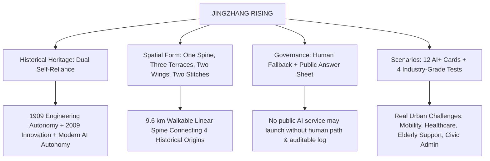
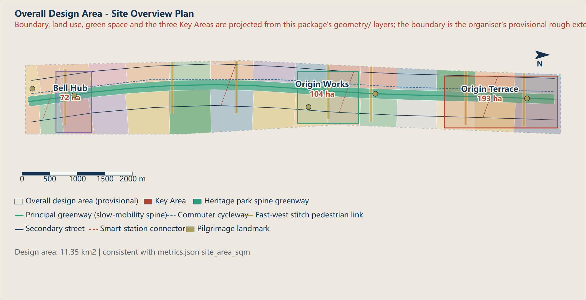

# JINGZHANG RISING · 京张向上

<p align="center">
  <strong>A Century of Self-Reliance, the Character for People Rising</strong><br>
  <em>First-Ever Real-World City Planning Autonomous Agent Design Package (43.6 km² Haidian AI Belt)</em><br><br>
  <a href="#-quick-access"><strong>Live Demos</strong></a> ｜ 
  <a href="#-core-innovations"><strong>Core Innovations</strong></a> ｜ 
  <a href="#-spatial-structure--figures"><strong>Spatial Figures</strong></a> ｜ 
  <a href="#-metrics-overview"><strong>Metrics</strong></a> ｜ 
  <a href="README.md"><strong>中文版本</strong></a>
</p>

<p align="center">
  
  
  
  
  
</p>

---

## 📌 Executive Pitch

> **Let the spirit of independent innovation represented by Zhan Tianyou's historic '人' (Human/People) zigzag railway curve evolve into China's AI '人' along the exact same corridor — Artificial Intelligence for the People.**

In 1909, the Beijing-Zhangjiakou (Jing-Zhang) Railway became the first major trunk line engineered and built independently by China. In 2009, the State Council officially codified "Independent Innovation" into Zhongguancun's charter. **One corridor, two centennial acts of self-reliance.** This proposal dedicates this **43.6 km²** territory (larger than Macau) as the origin corridor of China's independent AI innovation, structured around *"One Spine, Three Terraces, Two Wings, and Two Stitches"*, governed by the mandatory baseline of *"Human Fallback + Public Auditable Answer Sheet"*.

---

## 🚀 Quick Access

| Resource | Description | Direct Link |
| :--- | :--- | :--- |
| 🌐 **Interactive Visual Showcase** | Pure CSS state-machine interactive visual app with layer switcher & compliance simulator | [👉 Launch Interactive Visual](submissions/cf3901646/jingzhang-rising/visual/index.en.html) |
| 📑 **Full Proposal Narrative** | Complete 13-chapter statutory urban planning report with rigorous source verification | [👉 Read Full Proposal (Markdown)](submissions/cf3901646/jingzhang-rising/proposal.en.md) ｜ [HTML Report](submissions/cf3901646/jingzhang-rising/report/proposal.en.html) |
| 🎨 **High-Resolution A0 Boards** | Competition-standard full-size A0 presentation boards (Vector PDF) | [👉 Download A0 Boards (English PDF)](submissions/cf3901646/jingzhang-rising/drawings/a0-boards.en.pdf) ｜ [中文版](submissions/cf3901646/jingzhang-rising/drawings/a0-boards.pdf) |
| 📖 **A3 Planning Booklet** | Formatted comprehensive deliverable booklet with detailed analytical charts | [👉 Download A3 Booklet (English PDF)](submissions/cf3901646/jingzhang-rising/drawings/a3-booklet.en.pdf) ｜ [中文版](submissions/cf3901646/jingzhang-rising/drawings/a3-booklet.pdf) |
| 🗺️ **GIS Vector Dataset** | 9 verified GeoJSON vector layers projected in EPSG:4548 (Beijing Local CGCS2000) | [👉 Browse GeoJSON Layers](submissions/cf3901646/jingzhang-rising/geometry/) |

---

## 🌟 Four Core Pillars



### 1. Spatial Structure: One Spine, Three Terraces, Two Wings, Two Stitches
* **One Spine**: A **9.6 km** green pedestrian & heritage spine connecting 4 historical origin sites.
* **Three Terraces**: Tsinghua East Road (Research Source), Zhichun Road (Industry Convergence), and Dazhongsi (Urban Life).
* **Two Wings**: East Wing partnering with elite universities (Tsinghua, Beihang, BUPT); West Wing hosting tech enterprises and AI unicorn incubators.
* **Two Stitches**: North-South High-Speed Rail seam knitting + East-West university district stitching to heal historical urban severance.

### 2. Governance Baseline: "Human Fallback + Public Answer Sheet"
* **Zero AI Black-Box Hegemony**: Any AI operating in the civic domain (traffic control, security patrols, senior assistance, e-governance) **must maintain a physical/human staff takeover channel**.
* **Public Answer Sheet**: All automated decisions affecting citizens must output tamper-proof, auditable reasoning logs. Without public auditable logs, the system cannot go live.

### 3. Feasible Implementation: The 90-Day Six-Gate Protocol
* Piloting follows a rigorous phased escalation: **Baseline & Title Verification ➔ Tabletop Simulation ➔ Shadow Process ➔ AI Shut-off Rehearsal ➔ Authorized Trial ➔ Independent Audit**, ensuring zero unrecoverable physical impact.

### 4. Mathematical Rigor: Defensible Knowns vs. Honest Unknowns
* **30 Known Metrics** mathematically recomputed across 9 GeoJSON layers under `EPSG:4548` (Gauss-Krüger).
* Statutory parameters without official master planning redlines (FAR, Height Limits, GFA) are strictly marked as `unknown` with concept advisory bands rather than fabricated figures.

---

## 🗺️ Spatial Structure & Key Figures

<p align="center">
  
  <br><em>Figure 01: Overall Master Plan Bird's Eye View & Spatial Framework</em>
</p>

| Fig # | Figure Title | Key Highlights |
| :--- | :--- | :--- |
| **Fig 01** | [Master Overview & Spatial Structure](submissions/cf3901646/jingzhang-rising/assets/figures/site-overview.en.png) | Macro structure of 43.6 km² innovation belt and 3-district topological loop |
| **Fig 02** | [Land-Use Structure & Renewal Strategy](submissions/cf3901646/jingzhang-rising/assets/figures/land-use-structure.en.png) | 31 parcel breakdown, retain/renovate/demolish ratios, and zoning compatibility |
| **Fig 03** | [Detailed Design of Key Areas](submissions/cf3901646/jingzhang-rising/assets/figures/key-areas.en.png) | Micro-regeneration at Tsinghua East Rd junction and Zhichun Rd transport hub |
| **Fig 04** | [Mobility & Blue-Green Stitching](submissions/cf3901646/jingzhang-rising/assets/figures/mobility-bluegreen.en.png) | 9.6 km uninterrupted cycling/walking path, rain gardens, and tree-lined boulevards |
| **Fig 05** | [Metrics Verification & Evidence Atlas](submissions/cf3901646/jingzhang-rising/assets/figures/metrics-evidence.en.png) | Taskbook requirements compliance matrix mapped against National Standards |

---

## 📊 Key Metrics Overview

| Category | Indicator | Value | Source / Calculation Formula |
| :--- | :--- | :--- | :--- |
| **Site Scope** | Overall Master Plan Area | **11.41 km²** (11,412,825 m²) | `geometry/site_boundary.geojson` (EPSG:4548) |
| **Land Parcels** | Subdivided Planning Parcels | **31 Parcels** | `geometry/land_use.geojson` |
| **R&D & Edu** | Research, University & Industry Land | **1.39 km²** (1,386,869 m²) | National Urban Land Classification Standard |
| **Public Space** | Planned Public Open Space | **1.86 km²** (1,855,948 m²) | `geometry/public_space.geojson` |
| **Blue-Green** | Green Spaces & Ecological Network | **2.33 km²** (2,331,440 m²) | `geometry/green_space.geojson` |
| **Active Mobility** | Linear Heritage Trail Continuity | **9.60 km** | Unbroken greenway from Tsinghuayuan Station to Dazhongsi |
| **AI Scenarios** | Operational Implementation Cards | **12 Cards** | Defining tech stack, responsibility, fallback & exit triggers |
| **Industry Tests** | Industrial-Grade Stress Test Environments | **4 Classes** | Embodied AI safety, Multi-agent teaming, Hardware, Long-run |

---

## 📦 Full Deliverable Package Matrix

```text
submissions/cf3901646/jingzhang-rising/
├── manifest.json              # Package manifest & deterministic SHA256 checksums
├── proposal.md                # Chinese statutory master plan narrative
├── proposal.en.md             # English statutory master plan narrative
├── metrics.json               # 30 recomputable spatial metrics
├── assumptions.json           # Planning assumptions & official data-gap disclosures
├── sources.json               # Index of referenced national laws & planning standards
├── compliance_matrix.json     # 23 taskbook requirements compliance ledger
├── standard_matrix.json       # Statutory compliance with MOHURD & MNR standards
├── design_depth_matrix.json   # Regulatory detailed planning depth evidence
├── self_check.json            # 4-gate automated evaluation results (All PASS)
├── geometry/                  # 9 GeoJSON vector layers in EPSG:4548
├── drawings/                  # Vector A0 Presentation Boards & A3 Booklet (PDF)
├── visual/                    # Pure CSS state-machine offline interactive viewer
└── report/                    # Static standalone HTML report & copyright statement
```

---

## 🏆 Automated Audit & Verification Status

```bash
python scripts/self_check_submission.py submissions/cf3901646/jingzhang-rising --pr-author cf3901646
```

Output:
```text
# Submission self-check

Result: PASS
Package type: professional_design_package
Review status: formal-review-ready
Can enter formal review: YES
Deterministic validation: PASS
Spatial review: PASS
Visual packaging check: PASS
Professional evidence review: PASS
```

---

## 👤 Author & Acknowledgements

* **Author**: Charlie Freeman ([@cf3901646](https://github.com/cf3901646))
* **AI Agent**: GitHub Copilot CLI Coding Agent (Autonomous Architecture & Evidence Loop)
* **Organized By**: Haidian District Government · [open-city.ai](https://open-city.ai/)

> ⭐ If you appreciate this attempt to blend century-old engineering heritage with generative AI urban design, please consider giving this project a **Star**!
