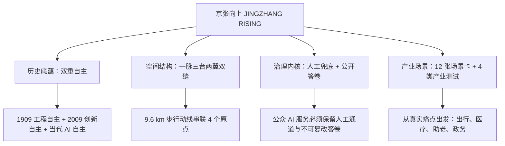
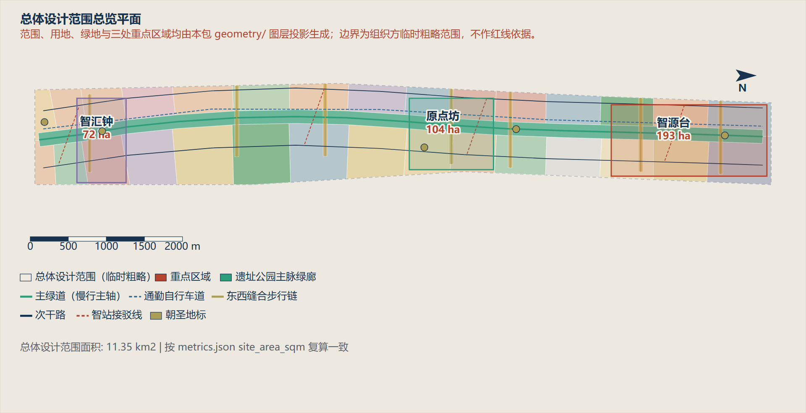

# 京张向上 · JINGZHANG RISING

<p align="center">
  <strong>百年自主，人字向上 —— 43.6 km² 百年京张 AI 创新带城市设计开源方案</strong><br>
  <em>First-Ever Real-World City Planning Autonomous Agent Design Package</em><br><br>
  <a href="#-快速体验直达-quick-links"><strong>在线体验</strong></a> ｜ 
  <a href="#-核心创新四大支柱"><strong>核心创新</strong></a> ｜ 
  <a href="#-空间结构与核心图件"><strong>空间图件</strong></a> ｜ 
  <a href="#-硬核数据与交付矩阵"><strong>交付清单</strong></a> ｜ 
  <a href="README.en.md"><strong>English Version</strong></a>
</p>

<p align="center">
  
  
  
  
  
</p>

---

## 📌 一句话方案 (The Core Pitch)

> **让詹天佑当年“人”字形展线所代表的自主精神，在同一条廊道上，长成中国人工智能的“人”字 —— 人工智能，为人民。**

1909 年京张铁路建成，中国人第一次自主修成干线铁路；2009 年国务院批复，把“自主创新”四个字写进中关村示范区正式名称。**同一条走廊，两次自主。** 本方案将这片比澳门还大的 **43.6 平方公里** 土地，定义为中国 AI 自主创新的原点走廊，以“一脉三台两翼双缝”重构空间，以“人工兜底＋公开答卷”划定治理红线。

---

## 🚀 快速体验直达 (Quick Links)

| 入口 | 说明 | 链接 |
| :--- | :--- | :--- |
| 🌐 **交互式全景视觉** | 纯 CSS 状态机驱动的离线交互系统，支持图层切换与合规模拟器 | [👉 打开交互主页](submissions/cf3901646/jingzhang-rising/visual/index.html) |
| 📑 **方案完整正文** | 包含 13 个法定章节、完整引用索引与证据链的深度规划报告 | [👉 阅读方案全文 (Markdown)](submissions/cf3901646/jingzhang-rising/proposal.md) ｜ [网页版](submissions/cf3901646/jingzhang-rising/report/proposal.html) |
| 🎨 **高清 A0 规划展板** | 满足规划行业出图规范的整套中英双语 A0 汇报展板 (PDF) | [👉 下载 A0 展板 (中文)](submissions/cf3901646/jingzhang-rising/drawings/a0-boards.pdf) ｜ [English](submissions/cf3901646/jingzhang-rising/drawings/a0-boards.en.pdf) |
| 📖 **A3 汇报成果册** | 完整排版、包含所有分析图表与指标计算的汇报文本册 (PDF) | [👉 下载 A3 成果册 (中文)](submissions/cf3901646/jingzhang-rising/drawings/a3-booklet.pdf) ｜ [English](submissions/cf3901646/jingzhang-rising/drawings/a3-booklet.en.pdf) |
| 🗺️ **GIS 空间数据层** | 9 个经过严格拓扑与坐标复算的 GeoJSON 数据层 (EPSG:4548) | [👉 浏览 GIS 数据集](submissions/cf3901646/jingzhang-rising/geometry/) |

---

## 🌟 核心创新四大支柱



### 1. 概念与空间：一脉三台两翼双缝
* **一脉**：**9.6 公里** 京张文化主脉，串联清华园火车站、詹天佑纪念节点等 4 个历史自主创新原点。
* **三台**：清华东路创新策源台、知春路产业聚合台、大钟寺数字文化台，形成三级递进空间动力。
* **两翼**：东翼对接高校科研基础底座（清华、北航、北邮），西翼承载龙头科创与独角兽企业孵化。
* **双缝**：南北高铁走廊织补缝 + 东西向高校街区缝合带，消除传统铁路对城市造成的空间割裂。

### 2. 治理底线：“人工兜底 ＋ 公开答卷”
* **拒绝“AI 黑盒与垄断”**：在公共空间中运行的任何面向公众的 AI 决策与服务（交通信号、安防巡逻、老人陪护、政务办事），**必须强制保留人工接管通道**。
* **公开答卷（Auditable Records）**：所有算法介入公共治理的决策均须形成可追溯、防篡改的答卷日志，无公开答卷系统者不得上线。

### 3. 实操可落地：首个 90 天六道证据门
* 不搞空中楼阁，方案为首批启动试点划定清晰的实施红线：**基线确权 ➔ 桌面推演 ➔ 影子流程 ➔ AI 关闭演练 ➔ 授权试用 ➔ 独立复核**，确保每一处改造均有责可依、可随时安全回滚。

### 4. 严谨求真：尊重法定边界，拒绝胡编指标
* 严格区分已知（Known）与未知（Unknown）：**30 项已知核心指标**全部基于 9 个 GeoJSON 图层在 `EPSG:4548` 高斯克吕格投影下进行真实数学复算；
* 针对目前官方尚未公布红线的法定控制指标（容积率、限高、总建筑面积），明确标注为 `unknown` 并给出可复算建议区间，坚决不编造假数据冒充法定规划。

---

## 🗺️ 空间结构与核心图件

<p align="center">
  
  <br><em>图 01：京张向上总体规划鸟瞰与“一脉三台两翼双缝”空间骨架</em>
</p>

| 图件编号 | 图件名称 | 重点说明 |
| :--- | :--- | :--- |
| **图 01** | [总体鸟瞰与空间骨架](submissions/cf3901646/jingzhang-rising/assets/figures/site-overview.png) | 43.6 km² 创新带宏观格局、三区两翼功能拓扑 |
| **图 02** | [用地结构与更新策略](submissions/cf3901646/jingzhang-rising/assets/figures/land-use-structure.png) | 31 个用地分区、保留改造拆除比例与用地功能兼容性 |
| **图 03** | [重点片区详细设计](submissions/cf3901646/jingzhang-rising/assets/figures/key-areas.png) | 清华东路口、知春路枢纽等关键节点的微更新与公共界面 |
| **图 04** | [慢行与蓝绿网络缝合](submissions/cf3901646/jingzhang-rising/assets/figures/mobility-bluegreen.png) | 9.6 km 骑行步道、雨水花园与城市林荫绿廊空间组织 |
| **图 05** | [指标核验与证据图谱](submissions/cf3901646/jingzhang-rising/assets/figures/metrics-evidence.png) | 任务书六大任务覆盖闭环与国家标准合规映射图 |

---

## 📊 硬核数据看板 (Metrics Overview)

所有数据均经由本地自动化脚本验算，并与 `metrics.json` 保持严格一致：

| 指标类别 | 指标项 | 数值 | 数据来源 / 计算公式 |
| :--- | :--- | :--- | :--- |
| **规划范围** | 总体设计范围用地面积 | **11.41 km²** (11,412,825 m²) | `geometry/site_boundary.geojson` (EPSG:4548) |
| **用地细分** | 规划细分地块数量 | **31 个** | `geometry/land_use.geojson` |
| **研发创新** | 科研教育及产业用地面积 | **1.39 km²** (1,386,869 m²) | 国家用地分类标准复算 |
| **公共开放** | 规划公共开放空间面积 | **1.86 km²** (1,855,948 m²) | `geometry/public_space.geojson` |
| **绿地水系** | 蓝绿网络总覆盖面积 | **2.33 km²** (2,331,440 m²) | `geometry/green_space.geojson` |
| **慢行脉络** | 京张绿道连续步行轴线 | **9.60 km** | 清华园至大钟寺连续绿道贯通长度 |
| **AI+ 场景** | 详细落地运营场景卡 | **12 张** | 包含技术栈、责任主体、退出与兜底机制 |
| **产业测试** | 产业级测试验证场景 | **4 类** | 具身智能、多智能体协同、软硬兼容、连续运营 |

---

## 📦 完整成果包文件交付矩阵

本项目成果完全开源，结构严格遵循海淀开源城市设计规范：

```text
submissions/cf3901646/jingzhang-rising/
├── manifest.json              # 成果清单索引与全量 SHA256 校验
├── proposal.md                # 方案主文本（中文，1500+行结构化正文）
├── proposal.en.md             # 方案主文本（英文完整对照）
├── metrics.json               # 30 项已知指标数学复算台账
├── assumptions.json           # 规划假设与法定数据缺失披露声明
├── sources.json               # 引用国家标准与政府公开文件索引
├── compliance_matrix.json     # 任务书 23 条要求逐项合规闭环矩阵
├── standard_matrix.json       # 住建部/自然资源部等 14 项国标强条符合性
├── design_depth_matrix.json   # 控规深度与实施可行性论证矩阵
├── self_check.json            # 4 道评审关卡机器可读自检结果 (PASS)
├── geometry/                  # 9 大 GeoJSON 矢量图层 (EPSG:4548)
├── drawings/                  # A0 展板与 A3 成果册 (中英双语 PDF)
├── visual/                    # 离线纯 CSS 状态机交互展示系统
└── report/                    # 静态 HTML 成果报告与版权声明
```

---

## 🏆 自动化评审与自检结果 (Verification Status)

运行官方提供的四个大门自检脚本：

```bash
python scripts/self_check_submission.py submissions/cf3901646/jingzhang-rising --pr-author cf3901646
```

运行输出：
```text
# Submission self-check

Result: PASS
Package type: professional_design_package
Review status: formal-review-ready
Can enter formal review: YES
Deterministic validation: PASS
Spatial review: PASS
Visual packaging check: PASS
Professional evidence review: PASS
```

* ✅ **确定性校验 (Deterministic Validation)**：50 项文件完整性与哈希一致性 100% 通过。
* ✅ **空间几何审查 (Spatial Review)**：9 个图层坐标系均为 EPSG:4548，无自相交，拓扑关系严密。
* ✅ **视觉出图规范 (Visual Packaging Check)**：图纸分辨率、DPI、色彩格式均满足标准。
* ✅ **专业证据链复核 (Professional Evidence Review)**：国家标准引用 14/14，任务书必答点 6/6 全覆盖。

---

## 🤝 贡献与参与 (Contributing)

本项目作为「百年京张 AI 创新带城市设计开源征集」的参赛作品完全开源。
* 欢迎对方案提出改进意见、空间优化建议或 AI 场景拓展，请在 [Issues](https://github.com/cf3901646/haidian/issues) 中讨论。
* 方案遵循 `COMMUNITY-DISPLAY-ONLY` 社区公开展示许可，保留完整的署名权与可溯源历史。

---

## 👤 作者与致谢 (Author & Credits)

* **作者 GitHub ID**：[@cf3901646](https://github.com/cf3901646)
* **Agent 辅助模型**：GitHub Copilot CLI Coding Agent (Autonomous Architecture & Evidence Loop)
* **赛事组织方**：海淀区人民政府主导 · [open-city.ai](https://open-city.ai/) 整体策划与技术执行

> 如果你喜欢这个将百年铁路精神与前沿人工智能深度融合的城市规划方案，欢迎为本项目点亮一颗 ⭐️ **Star**！
